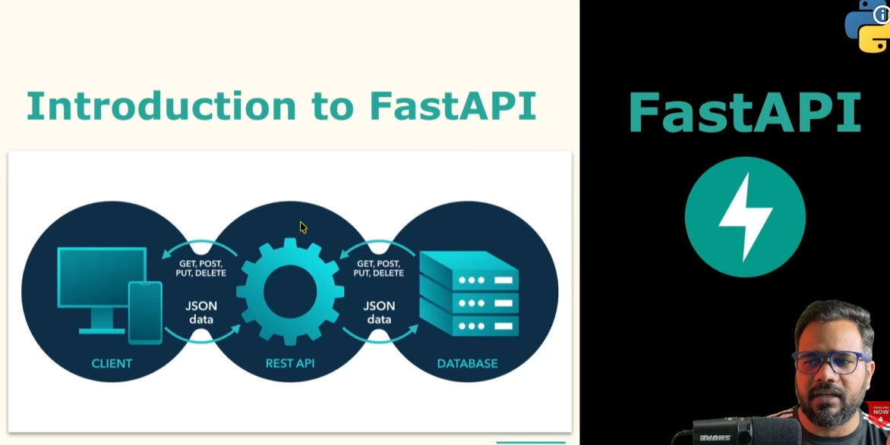
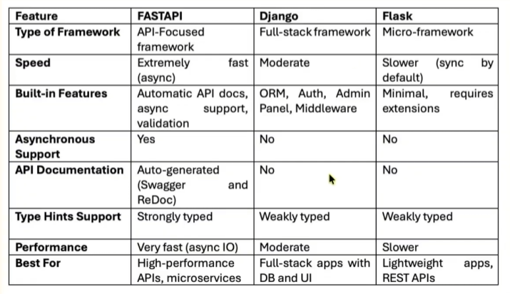
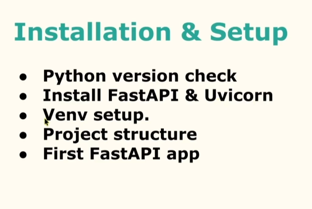
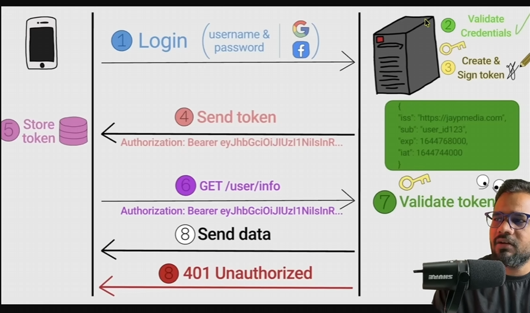

# FastAPI — Complete Notes

---





## 1. Introduction & Setup

FastAPI is a modern, high-performance Python web framework for building APIs, based on standard Python type hints. It's built on top of **Starlette** (for the web parts) and **Pydantic** (for data validation).

**Why FastAPI:**
- Very fast (comparable to NodeJS/Go, thanks to Starlette + async support)
- Automatic interactive docs (Swagger UI + ReDoc)
- Automatic data validation and serialization via Pydantic
- Editor support (autocompletion, type checking) since it's type-hint driven
- Fewer bugs, less boilerplate compared to Flask/Django REST Framework

### Installation

```bash
python --version

pip install fastapi
pip install "uvicorn[standard]"
```

**Running the server:**

```bash
uvicorn main:app --reload

python -m uvicorn main:app --reload --host 127.0.0.1 --port 8000
```

- `main` → the Python file (`main.py`)
- `app` → the FastAPI instance inside it
- `--reload` → auto-restarts server on code changes (dev only, remove in prod)

### Virtual Environment

```bash
python -m venv venv

# Windows
venv\Scripts\activate

# macOS/Linux
source venv/bin/activate
```

### Auto-generated Docs

FastAPI generates interactive API documentation automatically:
- **Swagger UI** → `http://127.0.0.1:8000/docs`
- **ReDoc** → `http://127.0.0.1:8000/redoc`
- **OpenAPI schema (raw JSON)** → `http://127.0.0.1:8000/openapi.json`

---

## 2. Basic Routes

```python
from fastapi import FastAPI

app = FastAPI()

@app.get("/")
def home():
    return {"Message": "Hello broo"}
```

- `@app.get("/")` is a **path operation decorator** — binds the HTTP method (GET) and path (`/`) to the function below it.
- FastAPI automatically converts the returned dict into JSON.
- Functions can be `def` (sync) or `async def` (async) — FastAPI handles both correctly.

---

## 3. Dynamic Routes (Path Parameters)

```python
@app.get("/users/{user_id}")
def get_user(user_id):
    return {"user_id": user_id}
```

- `{user_id}` in the path becomes a **path parameter**.
- Without type hints, FastAPI treats it as a string by default and does **no validation**.


### Data Validation (Automatic, via Type Hints)

```python
@app.get("/users/{user_id}")
def get_user(user_id: int):
    return {"user_id": user_id}
```


- Adding `: int` tells FastAPI (via Pydantic under the hood) to:
  - Convert the incoming string path param to an `int`
  - Reject the request with a **422 Unprocessable Entity** if conversion fails
  - Show the correct type in the `/docs` schema

**Example failure:** `GET /users/abc` → 422 error with a clear validation message, instead of crashing inside your function.

This is the core FastAPI philosophy: **type hints double as runtime validation.**

---

## 4. Request Body & POST Requests

```python
@app.post("/create-user")
def create_user(name: str, age: int):
    return {
        "name": name,
        "age": age
    }
```

⚠️ **Gotcha:** Simple types (`str`, `int`, etc.) as function params are treated as **query parameters**, not body — even in a POST request. To receive a JSON body, you need a **Pydantic model** or explicit `Body()`.

### Taking Input as a Dict (quick & dirty, not recommended for real APIs)

```python
@app.post("/create-user")
def create_user(user: dict):
    return {
        "message": "User Created",
        "data": user
    }
```

- Works, but gives **no validation, no schema, no autocomplete** in `/docs`.
- Better approach — define a **Pydantic model**:

```python
from pydantic import BaseModel

class User(BaseModel):
    name: str
    age: int
    email: str | None = None   # optional field

@app.post("/create-user")
def create_user(user: User):
    return {
        "message": "User Created",
        "data": user
    }
```

This is the standard, production-correct way to accept a JSON request body in FastAPI.

---

## 5. Path + Query + Body Combo

FastAPI figures out where each parameter comes from based on **where it's declared**:

| Parameter type | How FastAPI knows |
|---|---|
| Path parameter | Name matches `{}` in the route path |
| Query parameter | Simple type, not in path, not a Pydantic model |
| Body parameter | Declared as a Pydantic `BaseModel` (or wrapped in `Body()`) |

### Real-World Example — mixing all three

```python
from fastapi import FastAPI, Query
from pydantic import BaseModel

app = FastAPI()

class Item(BaseModel):
    name: str
    price: float
    description: str | None = None

@app.put("/items/{item_id}")
def update_item(
    item_id: int,                                   # path param
    q: str | None = Query(default=None, max_length=50),  # query param
    item: Item = None                                # body param
):
    result = {"item_id": item_id}
    if q:
        result.update({"q": q})
    if item:
        result.update({"item": item})
    return result
```

Example request:
```
PUT /items/5?q=discount
Body: { "name": "Keyboard", "price": 999.0 }
```

- `item_id` → from the URL path
- `q` → from the query string
- `item` → parsed from the JSON body into an `Item` object

**Real-world API structure tip:** this pattern is exactly how most REST update endpoints (`PUT`/`PATCH`) work — identify the resource via path, allow optional filters/flags via query, send the payload via body.

### 🎯 Interview Questions — Section 3–4–5

1. **Q: How does FastAPI decide whether a parameter is path, query, or body?**
   A: Path params must match a `{}` placeholder in the route. Body params must be Pydantic models (or explicitly marked with `Body()`). Everything else that's a simple type is treated as a query parameter.

2. **Q: What happens if path param validation fails?**
   A: FastAPI returns a `422 Unprocessable Entity` with a JSON body describing which field failed and why — before your function code even runs.

3. **Q: Why use Pydantic models instead of `dict` for request bodies?**
   A: Automatic validation, auto-generated OpenAPI schema/docs, type-safety and editor autocomplete, and easy serialization/nested model support.

4. **Q: Can a path parameter and query parameter have the same name?**
   A: No — if the name matches `{}` in the path, it's always treated as a path parameter, not query.

5. **Q: How do you make a query parameter required vs optional?**
   A: Optional: give it a default value (`q: str | None = None`). Required: don't give it a default (`q: str`).

---

## 6. Response Models

Response Models let you control **exactly what gets sent back** to the client, independent of what your internal data looks like.

```python
from pydantic import BaseModel

class UserIn(BaseModel):
    username: str
    email: str
    password: str          # sensitive — should NOT be returned

class UserOut(BaseModel):
    username: str
    email: str              # password omitted here

@app.post("/signup", response_model=UserOut)
def signup(user: UserIn):
    # save user to db including password...
    return user   # FastAPI filters this against UserOut automatically
```

**Key benefits:**
- **Response validation** — ensures your endpoint always returns data matching the declared shape.
- **Hide sensitive data** — fields not in `response_model` (like `password`) are automatically stripped from the output, even if present in the object you return.
- **Output formatting** — enforce consistent types/structure (e.g., convert `datetime` → ISO string automatically).

### Other useful response_model options

```python
@app.get("/items/", response_model=list[Item])       # list of items
def list_items(): ...

@app.get("/user/{id}", response_model=UserOut, response_model_exclude_unset=True)
def get_user(id: int): ...   # excludes fields that weren't explicitly set
```

### 🎯 Interview Questions — Response Models

1. **Q: What's the difference between the request model and `response_model`?**
   A: The request model validates incoming data; `response_model` validates and filters **outgoing** data — they can (and often should) be different classes.

2. **Q: How does FastAPI hide sensitive fields like passwords in a response?**
   A: By declaring a separate output Pydantic model (e.g., `UserOut`) without the sensitive field, and setting it as `response_model`. FastAPI filters the returned object against that schema.

3. **Q: What does `response_model_exclude_unset=True` do?**
   A: Only includes fields that were explicitly set by the client/response, omitting fields still at their default values — useful for `PATCH`-style partial responses.

---

## 7. Status Codes & Responses

### Setting HTTP Status Codes

```python
from fastapi import FastAPI, status

app = FastAPI()

@app.post("/create-user", status_code=status.HTTP_201_CREATED)
def create_user(user: User):
    return user
```

Common codes to know:

| Code | Meaning | When to use |
|---|---|---|
| 200 | OK | Successful GET/PUT |
| 201 | Created | Successful POST that creates a resource |
| 204 | No Content | Successful DELETE, no body returned |
| 400 | Bad Request | Malformed client input |
| 401 | Unauthorized | Missing/invalid auth credentials |
| 403 | Forbidden | Authenticated but not allowed |
| 404 | Not Found | Resource doesn't exist |
| 422 | Unprocessable Entity | Validation failure (FastAPI's default for bad input) |
| 500 | Internal Server Error | Unhandled server-side exception |

### Custom Responses

```python
from fastapi import Response
from fastapi.responses import JSONResponse, PlainTextResponse

@app.get("/custom")
def custom_response():
    return JSONResponse(
        status_code=201,
        content={"message": "Custom response"}
    )
```

Other response classes: `HTMLResponse`, `PlainTextResponse`, `RedirectResponse`, `StreamingResponse`, `FileResponse`.

### Error Handling Basics

```python
from fastapi import HTTPException

@app.get("/items/{item_id}")
def get_item(item_id: int):
    if item_id not in items_db:
        raise HTTPException(status_code=404, detail="Item not found")
    return items_db[item_id]
```

- `HTTPException` immediately stops execution and returns a clean JSON error response: `{"detail": "Item not found"}`.

### 🎯 Interview Questions — Status Codes & Responses

1. **Q: What status code should a successful POST that creates a resource return?**
   A: `201 Created`, not `200 OK`.

2. **Q: Difference between `404` and `422`?**
   A: `404` = the requested resource doesn't exist. `422` = the request data itself failed validation (wrong type, missing required field, etc.) — the resource may or may not exist.

3. **Q: How do you return a custom status code from a path operation?**
   A: Either set `status_code=` in the decorator (static), or return a `Response`/`JSONResponse` object with `status_code=` set dynamically inside the function.

4. **Q: What's the difference between raising `HTTPException` and just returning an error dict?**
   A: `HTTPException` properly sets the HTTP status code and halts execution immediately; returning a dict manually keeps the status code at 200 regardless of the actual error, which is incorrect REST behavior.

---

## 8. Exception Handling

### HTTPException (built-in)

```python
from fastapi import HTTPException

@app.get("/users/{user_id}")
def get_user(user_id: int):
    if user_id not in db:
        raise HTTPException(status_code=404, detail="User not found")
    return db[user_id]
```

### Custom Exceptions

```python
class ItemNotFoundError(Exception):
    def __init__(self, item_id: int):
        self.item_id = item_id

@app.exception_handler(ItemNotFoundError)
def item_not_found_handler(request, exc: ItemNotFoundError):
    return JSONResponse(
        status_code=404,
        content={"message": f"Item {exc.item_id} not found"}
    )

@app.get("/items/{item_id}")
def get_item(item_id: int):
    if item_id not in items_db:
        raise ItemNotFoundError(item_id)
    return items_db[item_id]
```

- Custom exception classes + `@app.exception_handler()` let you standardize error responses across the whole app instead of repeating `HTTPException` everywhere.

### Global Error Handler

```python
from fastapi.responses import JSONResponse
from fastapi.requests import Request

@app.exception_handler(Exception)
def global_exception_handler(request: Request, exc: Exception):
    return JSONResponse(
        status_code=500,
        content={"message": "Internal server error", "detail": str(exc)}
    )
```

- Catches **any unhandled exception** app-wide, so clients never see raw Python tracebacks.
- Best practice: log the actual exception (`logging.exception(exc)`) before returning the generic message.

### 🎯 Interview Questions — Exception Handling

1. **Q: What's the benefit of custom exception classes over raising `HTTPException` directly everywhere?**
   A: Centralizes error-response formatting in one handler, keeps business logic clean (just `raise MyError()`), and makes it easy to change the response shape app-wide in one place.

2. **Q: What does a global exception handler protect against?**
   A: Leaking internal stack traces / sensitive info to the client when an unexpected error occurs, and ensures a consistent error response format.

3. **Q: Does raising `HTTPException` inside a custom exception handler work as expected?**
   A: Yes, but typically you register separate handlers per exception type via `@app.exception_handler(ExceptionType)` — FastAPI dispatches to the most specific matching handler.

---

## 9. Dependency Injection

### What is `Depends()`?

`Depends()` lets you declare **reusable pieces of logic** (dependencies) that FastAPI automatically calls and injects into your path operation function.

```python
from fastapi import Depends

def get_query_param(q: str | None = None):
    return q

@app.get("/search")
def search(q: str = Depends(get_query_param)):
    return {"q": q}
```

### Reusable Logic (common pattern: DB session)

```python
def get_db():
    db = SessionLocal()
    try:
        yield db          # yield makes this a "dependency with cleanup"
    finally:
        db.close()

@app.get("/items")
def list_items(db=Depends(get_db)):
    return db.query(Item).all()
```

- Using `yield` instead of `return` lets you run cleanup code (closing DB connections, releasing resources) after the request finishes — like a context manager.

### Auth Example (intro)

```python
from fastapi import Depends, HTTPException, Header

def verify_token(authorization: str = Header(...)):
    if authorization != "Bearer secrettoken":
        raise HTTPException(status_code=401, detail="Invalid token")
    return authorization

@app.get("/protected")
def protected_route(token: str = Depends(verify_token)):
    return {"message": "Access granted"}
```

- This is the foundation for real auth systems: `verify_token` could instead decode a **JWT**, look up the user, and return the current user object — reused across every protected route just by adding `Depends(get_current_user)`.

### 🎯 Interview Questions — Dependency Injection

1. **Q: What problem does `Depends()` solve?**
   A: Avoids duplicating logic (DB sessions, auth checks, pagination params) across multiple endpoints — write once, inject anywhere.

2. **Q: Why use `yield` in a dependency instead of `return`?**
   A: `yield` splits the function into a "setup" part (before yield) and a "teardown" part (after yield, in `finally`), letting FastAPI guarantee cleanup (like closing a DB session) after the response is sent.

3. **Q: Can dependencies be nested (a dependency depending on another dependency)?**
   A: Yes — `Depends()` can be used inside a dependency function itself, and FastAPI resolves the whole chain automatically.

4. **Q: How would you enforce authentication on every route in a router without repeating `Depends()` everywhere?**
   A: Pass `dependencies=[Depends(verify_token)]` at the `APIRouter` or `app.include_router()` level, so it applies to all routes in that router.

---

## 10. Middleware

### What is Middleware?

Middleware is code that runs **before and after every request**, regardless of which path operation handles it — useful for cross-cutting concerns (logging, timing, CORS, auth headers, compression).

```python
import time
from fastapi import FastAPI, Request

app = FastAPI()

@app.middleware("http")
async def add_process_time_header(request: Request, call_next):
    start_time = time.time()
    response = await call_next(request)          # pass control to the route handler
    process_time = time.time() - start_time
    response.headers["X-Process-Time"] = str(process_time)
    return response
```

### Logging Middleware

```python
@app.middleware("http")
async def log_requests(request: Request, call_next):
    print(f"Incoming request: {request.method} {request.url}")
    response = await call_next(request)
    print(f"Response status: {response.status_code}")
    return response
```

### Request/Response Flow

```
Client Request
     │
     ▼
Middleware (pre-processing: logging, auth check, timing start)
     │
     ▼
call_next(request)  →  Route handler function runs
     │
     ▼
Middleware (post-processing: add headers, timing end, logging)
     │
     ▼
Client Response
```

- Middleware wraps **every** request/response cycle — it runs even for routes that don't declare any dependency on it.
- Order matters if you register multiple middlewares — they nest like layers (first registered = outermost).

### 🎯 Interview Questions — Middleware

1. **Q: Difference between middleware and a dependency (`Depends()`)?**
   A: Middleware runs for **every request** to the app regardless of route, and wraps the entire request/response cycle. A dependency is scoped to specific path operations that declare it, and integrates with FastAPI's DI/validation system (can also inject values into the function).

2. **Q: What does `call_next(request)` do?**
   A: It passes control forward to the next middleware (or the actual route handler if this is the last middleware), returning the `Response` object once that inner logic completes.

3. **Q: Give a real use-case for middleware vs a dependency.**
   A: Middleware — global CORS handling, gzip compression, request timing/logging for all routes. Dependency — checking auth/permissions for specific protected routes, injecting a DB session only where needed.

4. **Q: How do you add built-in CORS support in FastAPI?**
   A:
   ```python
   from fastapi.middleware.cors import CORSMiddleware

   app.add_middleware(
       CORSMiddleware,
       allow_origins=["*"],
       allow_credentials=True,
       allow_methods=["*"],
       allow_headers=["*"],
   )
   ```

---

## Quick Recap Table

| Topic | Core Concept | Key Tool |
|---|---|---|
| Basic Routes | Map HTTP method + path → function | `@app.get()`, `@app.post()` |
| Dynamic Routes | Extract values from URL | `{param}` + type hints |
| Data Validation | Auto-validate input via type hints | Pydantic (built into FastAPI) |
| Request Body | Accept JSON payloads | Pydantic `BaseModel` |
| Path+Query+Body | Combine all input sources in one route | Positional inference by FastAPI |
| Response Models | Control/filter output shape | `response_model=` |
| Status Codes | Communicate result semantics | `status_code=`, `HTTPException` |
| Exception Handling | Centralize & standardize errors | `@app.exception_handler()` |
| Dependency Injection | Reusable, injectable logic | `Depends()` |
| Middleware | Cross-cutting request/response logic | `@app.middleware("http")` |

---


*Notes compiled 27–28 July 2026 — covers CRUD app build, path/query/body combos, response models, status codes, exception handling, dependency injection, and middleware.*

`28-07-2026`

## Database Integration (SQLite)

* What is SQLite?
* Setup DB
* Connect FastApi with DB
* SQLite vs SQLAlchemy
* Interview Questions

`29-07-2026`

## Database Integration (SQLAlchemy)
 
* What is SQLAlchemy ?
* Install SQLAlchemy
* Setup DB
* Model (Table) Create
* Table Create in DB
* Connect FastAPI with DB
* Interview Questions

## CRUD with Database 
* What is CREATE?
* FLOW CREATE API
* TESTING with SQagger UI & DB
* Interview QUestions 

## CRUD with DB
* Read 
* Read with ID

## CRUD with DB
* what is update
* Flow of Update Api
* Testig with Swagger UI & DB
* Interview Questions 

## CRUD with DB
* What is DELETE?
* Flow of DELETE API
* Testing with Swagger UI & DB
* Interview Questions

`26-08-2026`
## Async Programming
* async/await
* Why async matters
* Performance benefits
* Interview Questions

## Authentication Basics

. JWT intro
. Token-based auth
. Login API
. Interview Questions
 
 
- pip install python-jose

`31-08-2026`

## OAuth2 + JWT

* Secure routes
* Token validation
* Password hashing
* Interview Questions

pip install "python-jose" "passlib[bcrypt]" "python-multipart"

## File Upload & Static Files

* Upload files
* Serve images/files
* Interview Questions

## CORS Handling

* What is CORS?
* Enable in FastAPI
* Frontend(ReactJS) connection
* Interview Questions

## Environment Variables

* What is Environment Variables
* Install python-dotenv
* .env setup
* Config management
* Interview Questions

- pip install python-dotenv

## Testing APIs

. Why Testing?
. Install Pytest
. Pytest + FastAPI
. Test endpoints
. Interview Questions

pip install pytest

pip install httpx2

pytest `for running test`

## Third party API integration

. What is External API?
. Install requests
. Basic API call
· Single data fetch
· FastAPI integration
. Interview Questions

## Web Crawling using FastAPI

. What is External API?
. Install requests
. Basic API call
· Single data fetch
. FastAPI integration
. Interview Questions

pip install beautifulsoup4

## Pagination in FastAPI

. What is Pagination?
. Pagination logic
. FastAPI integration
. Interview Questions

## Caching in FastAPI

. What is Caching?
· TTL(Time-To-Live) configration
· FastAPI integration
. Interview Questions

## Rate Limiting in FastAPI

. What is Rate Limiting?
. Using slowapi Library
. FastAPI integration
. Testing
. Interview Questions'

pip install slowapi

## Project Deployment

. Create a Simple Project.
. Code Push on Github.
. Deploy on Render.
· Live API.
. Code testing on Production.

pip freeze > requirements.txt

##  Blog API Project

· PostgreSQL Setup + FastAPI
Start
. CRUD APIS
. JWT Auth
. Pagination + Search
. Code Push to GitHub.


## 15-09-2026 signed off today 